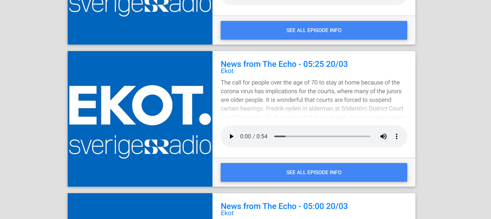
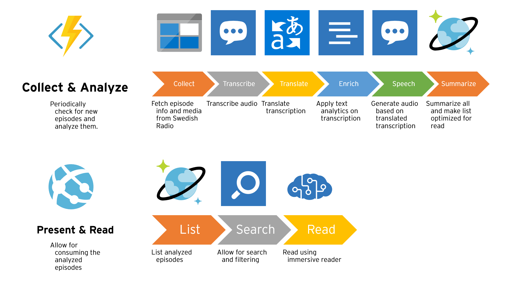
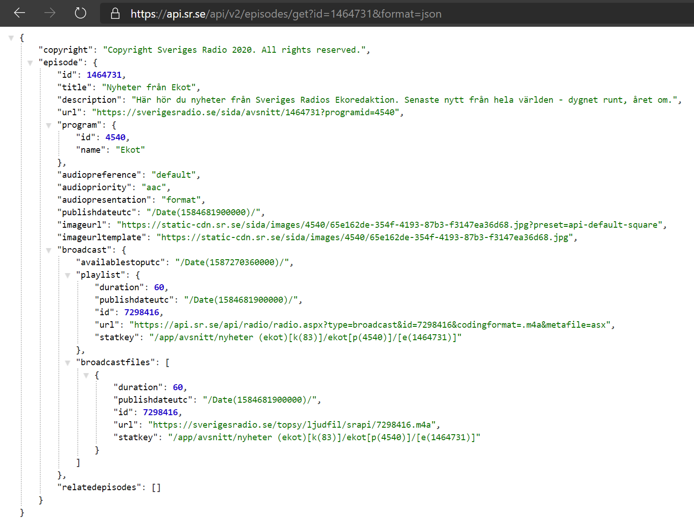
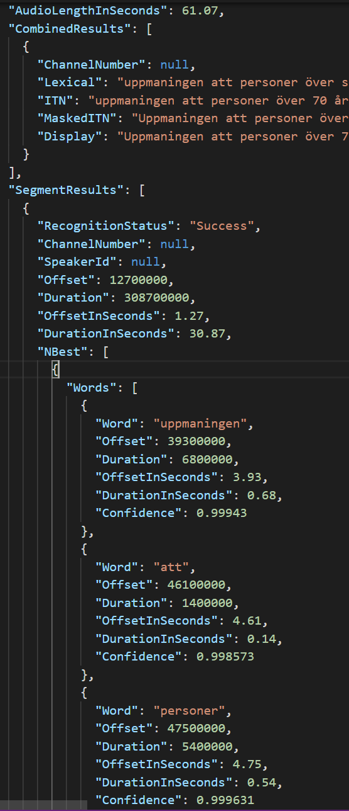
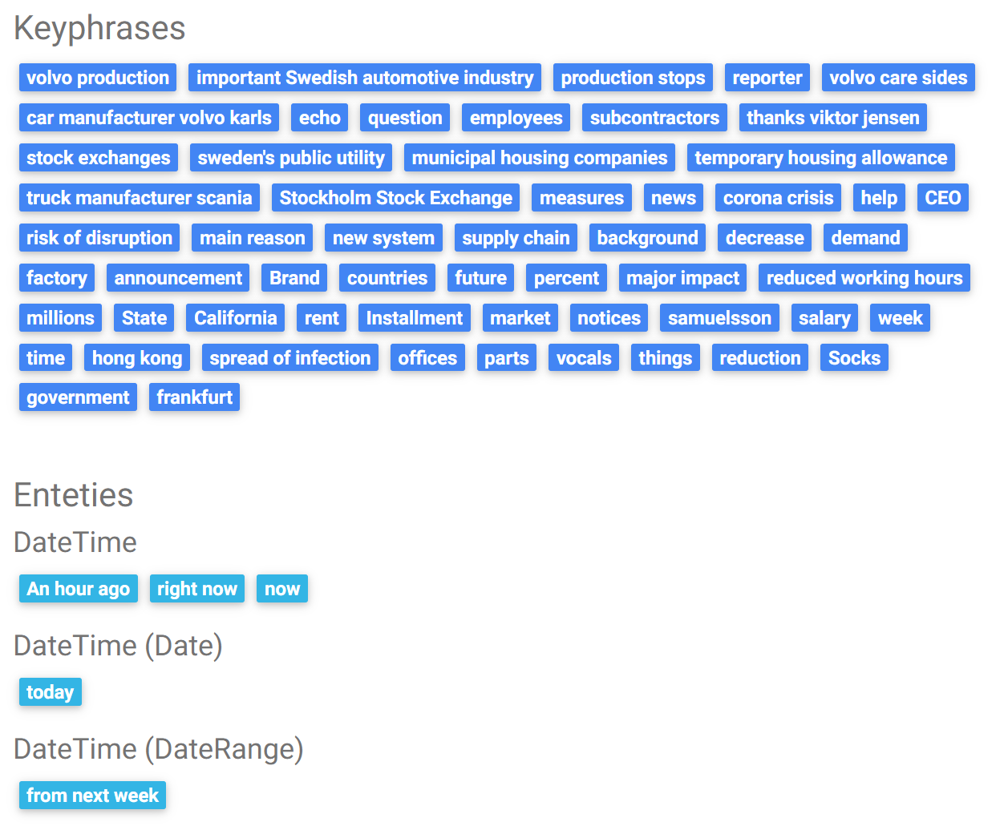
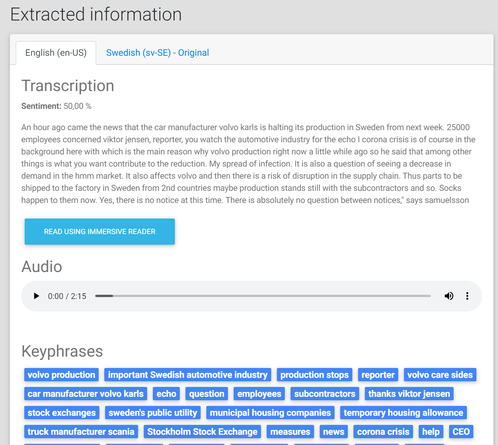
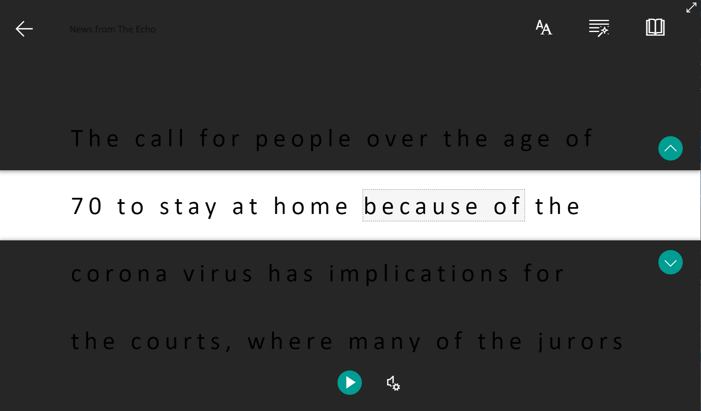
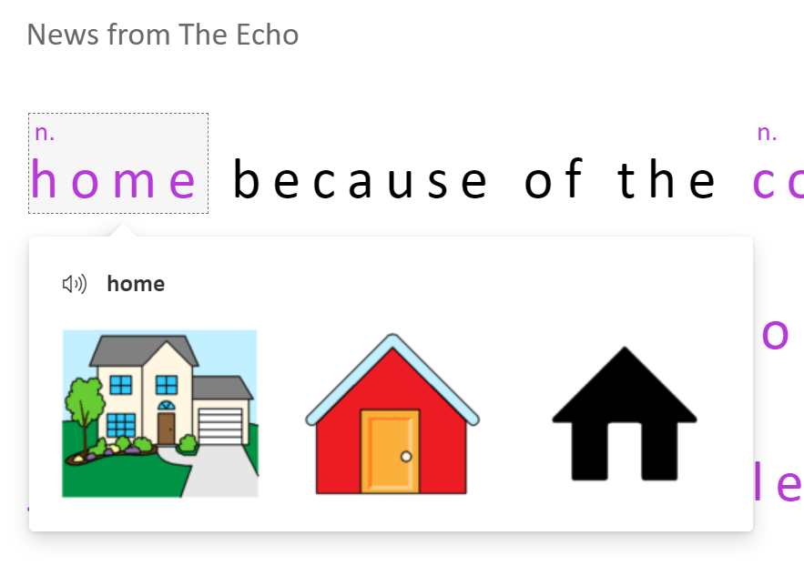
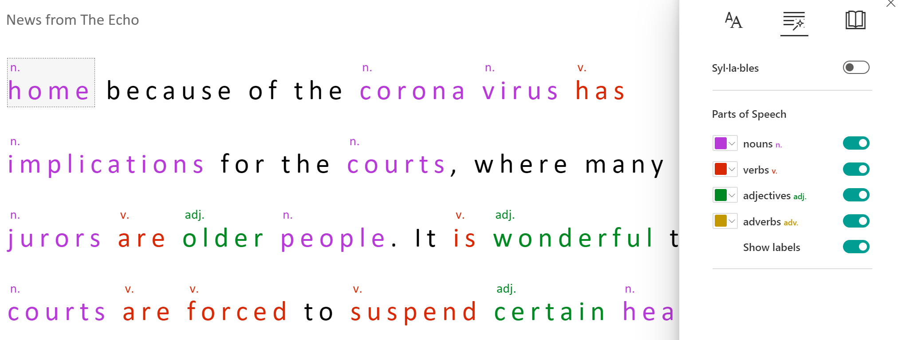

# RadioText.net

RadioText.net is a site that transcribes news episodes from [Swedish Radio](https://sverigesradio.se/) and makes them accessible. It uses multiple AI-based services in Azure from [Azure Cognitive Services](https://www.microsoft.com/cognitive-services) like Speech-to-Text, Text Analytics, Translation, and Text-to-Speech.

By using all of the services, you can listen to "Ekot" from Swedish Radio in English :)
_Disclaimer:_ The site is primarily a technical demo, and should be treated as such. 

# Background

Just to give you (especially non-Swedish) people a background. [Sveriges Radio (Swedish Radio)](https://sverigesradio.se/) is the public service radio in Sweden like BBC is in the UK. Swedish Radio does produce some shows in languages like [English](https://sverigesradio.se/radiosweden), [Finnish](https://sverigesradio.se/sisuradio/) and [Arabic](https://sverigesradio.se/radioswedenarabic) - but the majority is (for natural reasons) produced in Swedish.

The main news show is called [Ekot ("The Echo")](https://sverigesradio.se/ekot) and they broadcast at least once an hour and the broadcasts range from 1 minute to 50 minutes. The spoken language for Ekot is Swedish.

For some time, I had wanted to build a public demo with the AI Services in [Azure Cognitive Services](https://azure.microsoft.com/en-us/services/cognitive-services/), but as always with AI - you need some dataset to work with. It happens to be that [Sveriges Radio has an open API](https://sverigesradio.se/api/documentation/v2/index.html) with access to all of their publically available data, including audio archive - enabling me to work with the speech API:s.

# Architecture

The site runs in Azure and is heavily dependant on Cognitive Services. It's split into two parts, **Collect & Analyze** and **Present & Read**.

## Collect & Analyze

The collect & analyze part is a series of actions that will collect, transcribe, analyze and store the information about the episodes.

It's built using [.NET Core 3.1](https://dotnet.microsoft.com/) and can be hosted as an Azure function, Container or something else that can run continuously or on a set interval.

1.  The application periodically looks for a new episode of Ekot using the [Sveriges Radio open API](https://sverigesradio.se/api/documentation/v2/index.html). There is a [NuGet-package available](https://github.com/PeterOrneholm/Orneholm.SverigesRadio) that wraps the API for .NET (disclaimer, I'm the author of that package...). Once a new episode arrives, it caches the relevant data in Cosmos DB and the media in Blob Storage.

    * JSON Response: [https://api.sr.se/api/v2/episodes/get?id=1464731&format=json](https://api.sr.se/api/v2/episodes/get?id=1464731&format=json)

    

    The reason to cache the media is that the batch version of Speech-to-text [requires the media to be in Blob Storage](https://docs.microsoft.com/sv-se/azure/cognitive-services/speech-service/batch-transcription#storage).

2.  Once all data is available locally, it starts the asynchronous transcription using [Cognitive Services Speech-to-text API](https://azure.microsoft.com/en-us/services/cognitive-services/speech-to-text/). It specifically uses the [batch transcription](https://docs.microsoft.com/en-us/azure/cognitive-services/speech-service/batch-transcription) to support transcribing longer audio files. Note that the default speech recognition only supports 15 seconds because that one (as I've understood it) is more targeted towards understanding "commands".

    The raw result of the transcription is stored in Blob-storage, and the most relevant information is stored in Cosmos DB.
    
    The transcription contains the combined result (a long string of all the text) the individual words with timestamps. A sample of such file can be found below:
    * Original page at Sveriges Radio: [Nyheter från Ekot 2020-03-20 06:25](https://sverigesradio.se/sida/avsnitt/1464731?programid=4540)
    * Original audio: [Audio.mp3](https://sverigesradio.se/topsy/ljudfil/srapi/7298416.m4a)
    * Transcription (Swedish): [Transcription.json](https://poradiotextprod.blob.core.windows.net/samples/1464731/SR_4540__2020-03-20_05-25__1464731__OriginalAudio.m4a__Transcription_0.json)

    

    This site only uses the combined result but could improve the user experience by utilizing the data of individual words.

3.  All of the texts (title, description, transcription) are translated into English and Swedish (if those were not the original language of the audio) using [Cognitive Services Translator Text API](https://azure.microsoft.com/en-us/services/cognitive-services/translator-text-api/).

    Sample can be found here: https://radiotext.net/episode/1464731

4.  All texts mentioned above are analyzed using [Cognitive Services Text Analytics API](https://azure.microsoft.com/en-us/services/cognitive-services/text-analytics/). That provides sentiment analysis, keyphrases and (most important) named entities. Named entities are a great way to filter and search the episodes by. It's better than keywords, as it's not only a word but also what kind of category it is. The result is stored in Cosmos DB.

    

5.  The translated transcriptions are then turned back into audio using [Cognitive Services Text-to-Speech](https://azure.microsoft.com/en-us/services/cognitive-services/text-to-speech/). It produces one for English and one for Swedish. For English, there is support for the [Neural Voice](https://docs.microsoft.com/en-us/azure/cognitive-services/speech-service/language-support#neural-voices) and I'm impressed by the quality, almost indistinguishable from a human. The voice for Swedish is fine, but you will hear that it's computer-generated. The generated audio is stored in Blob Storage.

    * Original audio: [Audio.mp3](https://sverigesradio.se/topsy/ljudfil/srapi/7298416.m4a)
    * English audio (JessaNeural, en-US): [Speaker_en-US-JessaNeural.mp3](https://poradiotextprod.blob.core.windows.net/samples/1464731/SR_4540__2020-03-20_05-25__1464731__Speaker_en-US-JessaNeural.mp3)
    * Swedish audio (HedvigRUS, sv-SE): [Speaker_sv-SE-HedvigRUS.mp3](https://poradiotextprod.blob.core.windows.net/samples/1464731/SR_4540__2020-03-20_05-25__1464731__Speaker_sv-SE-HedvigRUS.mp3)

6. Last but not least, a summary of the most relevant data from previous steps are denormalized way, once again in Cosmos DB (using Table API).

## Present & Read

The site that presents the data is available at [https://radiotext.net/](https://radiotext.net/). It's built using [ASP.NET Core 3.1](https://docs.microsoft.com/en-us/aspnet/core/?view=aspnetcore-3.1) and is deployed as a Linux [Docker container to Dockerhub](https://hub.docker.com/r/peterorneholm/orneholmradiotextweb) and then released to an [Azure App Service](https://docs.microsoft.com/en-us/azure/app-service/containers/app-service-linux-intro).

Currently, it lists all episodes and allows for in-memory filtering and search. From the listing, you can see the first part of the transcription in English and listen to the English audio.

By entering the details page, you can explore the data in multiple languages as well as the original information from the API.

### Immersive reader

[Immersive Reader](https://azure.microsoft.com/en-us/services/cognitive-services/immersive-reader/) is a tool/service that's been available for some time as part of Office, like in [OneNote](https://www.onenote.com/learningtools). It's a great way to make reading and understanding texts easier. My wife works as a speech and language pathologist and says this tool is a great way to make enable people to understand texts. I've incorporated the service into Radiotext to allow the user to read the news using this tool.

Primarily, it can read the text for you, and highlight the words that are currently being read:

It can also explain certain words, using pictures:

And if you are learning about grammar, it can show you grammar details like what verbs are nouns, verbs, and adjectives:

I hadn't used this service before, but it shows great potential to make texts more accessible. Used with Speech-to-text, it can also give make audio more accessible.

# Cost

I've tried to get a grip on what the cost would be to do run this service and I estimate that to run all services for one episode of Ekot (5 minutes) the cost is roughly _€0,2_. That includes transcribing, translating, anayzing and generating audio for multiple languages.

* [Speech pricing](https://azure.microsoft.com/en-us/pricing/details/cognitive-services/speech-services/)
* [Translation pricing](https://azure.microsoft.com/en-us/pricing/details/cognitive-services/translator-text-api/)
* [Text analytics pricing](https://azure.microsoft.com/en-us/pricing/details/cognitive-services/text-analytics/)

Also, there will be a cost for running the web, analyzer, and storage.

# Ideas for improvement

The current application was done to showcase and explore a few services, but it's not in any way feature complete. Here are a few ideas on the top of my mind.

- **Improve accuracy with Custom Speech:** Using [Custom Speech}(https://docs.microsoft.com/en-us/azure/cognitive-services/speech-service/how-to-custom-speech) we could improve the accuracy of the transcriptions by training it on some common domain-specific words. For example, the jingle is often treated as a words, while it should not.
- **Enable subtitles:** Using the timestamp data from the transcription [subtitles](https://developer.mozilla.org/en-US/docs/Web/API/WebVTT_API) could be generated. That would enable a scenario where we can combine the original audio with subtitles.
- **Multiple voices:** A natural part of a news episode are interviews. And naturally, in interviews, there are multiple people involved. The audio I'm generating now is reading all texts with the same voice, so in scenarios when there are conversations it sounds kind of strange. Using [conversation transcription](https://docs.microsoft.com/en-us/azure/cognitive-services/speech-service/conversation-transcription) it could find out who says what and generate the audio with multiple voices.
- **Improve long audio:** The current solution will fail when generating audio for long texts. The [Long Audio API](https://docs.microsoft.com/en-us/azure/cognitive-services/speech-service/long-audio-api) allows for that.
- **Handle long texts:** Both translation and text analytics has limitations on the length of the texts. At the moment, the texts are cut if they are too long, but they could be split into multiple chunks and then analyzed and concatenated again.
- **Search using Azure Search:** At the moment the "search" and "filtering" functionality is done in memory, just for demo purposes. Azure Search allows for a much better search experience and could be added for that. Unfortunately, it does not allow for automatic indexing of Cosmos DB Table API [at the moment](https://feedback.azure.com/forums/263029-azure-search/suggestions/32759746-azure-search-should-be-able-to-index-cosmos-db-tab).
- **Custom Neural Voice:** I've always wanted to be a newsreader, and using [Custom Neural Voice](https://docs.microsoft.com/en-us/azure/cognitive-services/speech-service/how-to-custom-voice#custom-neural-voices) I might be able to do so ;) Custom Neural Voice can be trained on your voice and used to generate the audio. But, even if we could to this, it doesn't mean we should. Custom Neural Voice is one (maybe the only?) service you need to [apply for to be able to use](https://docs.microsoft.com/en-us/azure/cognitive-services/speech-service/concepts-gating-overview). In the world of fake news, I would vote for not implementing this.

# Disclaimer

This is an unofficial site, not built or supported by Sveriges Radio. It's based on the open data in their public API. It's built as a demo showcasing some technical services.

Most of the information is automatically extracted and/or translated by the AI in Azure Cognitive Services. It's based on the information provided by Swedish Radio API. It is not verified by any human and there will most likely be inaccuracies compared to the source.

All data belongs is retrieved from the Swedish Radio Open API (Sveriges Radios Öppna API) and is Copyright © Sveriges Radio.

# Try it out and contribute

The [Source code is available at GitHub](https://github.com/PeterOrneholm/RadioText.net) and [Docker image available at Dockerhub](https://hub.docker.com/r/peterorneholm/orneholmradiotextweb).

Hope you like it. Feel free to contribute :)